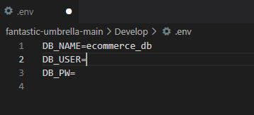
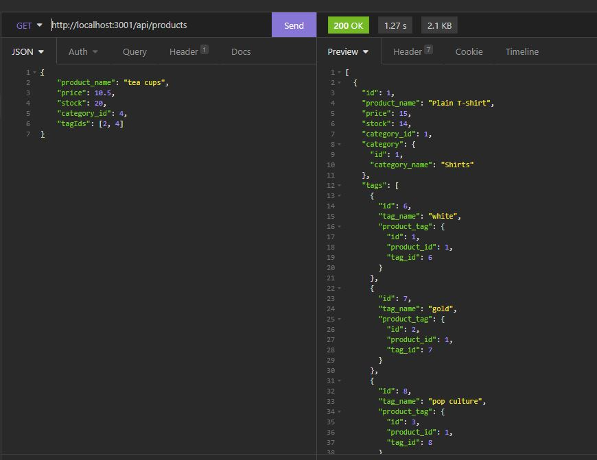

# Ecommerce_back_end

This project allows user to use Insomnia and Sequelize to manage database for their e-commerce. The database mainly consist of product, product's categories, and tags. User can check, create, update and delete data. 

#### Make sure add your MySQL username and password to the environment variable file.

#### Sample output below. 

#### Video Demo for this app
https://watch.screencastify.com/v/nc37mlkHjlprgHj22tuj

## Built With
* Javascript

## License
Licensed under the MIT license.

